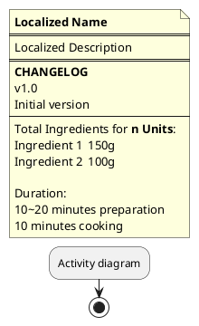

# Programmer's Cookbook

This is literally a cookbook for programmers or other humans who prefer activity diagrams over textbook instructions.

Recipes are collected from anywhere and translated from the native language to English or other languages.

Unless otherwise noted, recipes are licensed CC0/public domain.

[View Recipes](RECIPES.md)

## Recipe overview

Each recipe is written in PlantUML as activity diagram. There must be a note at the start stating the Name & Description of the recipe (localized), a CHANGELOG with all versions (english) and ingredients and baking/cooking duration of the recipe (english)

Versions are `vMAJOR.MINOR`. Every tested recipe starts at `v1.0`, minor changes to ingredients or durations increase the minor version. Adding or removing steps increase the major version.

Units are metric. Teaspoons (tsp.) and Tablespoons (tbsp.) are equal to US ones. If an ingredient is used multiple times on different steps, each amount should be specified and a total sum at the end.

Recipes are named `<english>-<lang>.puml`, where lang is an IETF language tag.

The steps of a recipe are represented as UML activity diagram with forks representing parallel actions.

Layout of a file:

## Translations

This is a translation table which might not be fully accurate but should help users translate recipes from/to other languages.

It is best to lookup ingredients from the original language if unsure about ingredients, even in translated recipes.

Ingredients
| DE | EN |
|---|---|
|Mehl|Flour|
|Zucker|Sugar|
|Milch|Milk|
|Salz|Salt|
|Ei|Egg|
|Eier|Eggs|
|Butter|Butter|
|Vanillezucker|Vanilla (or Vanillin) sugar|
|Puderzucker|Powdered sugar|
|Backpulver|Baking powder|
|Sahne|Cream|
|Schlagsahne|Whipped cream or just cream to whip|
|Saure Sahne|Sour Cream|
|Zimt|Cinnamon|
|Teig|Dough|
|Banane|Banana|
|Himbeere|Raspberry|
|Erdbeere|Strawberry|
|Zitrone|Lemon|
|Streusel|Crumbs/Crumble|

Processes
| DE | EN |
|---|---|
|Schmelzen/geschmolzen|melt/molten|
|verrühren/vermischen/verkneten|mix|
|erwärmen|heat|
|kühlen|cool|
|Backofen|oven|
|Backofen vorheizen|preheat oven|
|backen|bake|
|kochen|cook|
|Pfanne|pan|
|Topf|Pot|